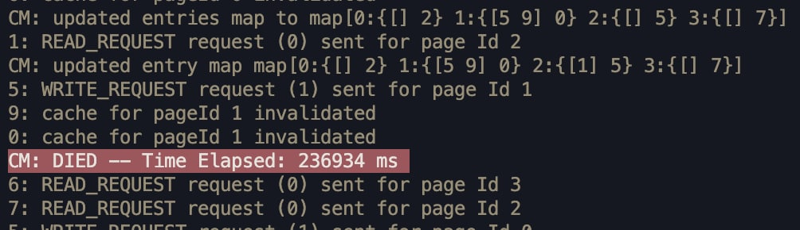

# DistributedSystemsPSets50.041

## **Assignment 3**

### Toh Kai Feng

### 1004581

## Introduction

This is the following file structure used:


1. To run non-fault tolerant version (Part 1):

```bash
cd Part1
go run -race main.go
```

2. To run fault tolerant version (Part 2):

```bash
cd Part2
go run -race main.go
```

# Part 1 Basic Ivy Protocol

This would be the output when part 1 is ran:


What we are looking for is that:

1. When a write request is made by processor A for pageId X,
2. All entries in the copyset, and entries held by the owner are invalidated.
3. Central Manager updates Processor A as the new owner.

### In the picture above,

Processor A making write request: 8

Processors in Copyset: [7,5,2]

Processor previously owner of page: 6

# Part 2 Fault Tolerant Ivy Protocol

## 2.1 Primary and Seconary Replicas with consistency

Every time a Primary CM handles a message from a processsor, the CM would forward it's state of Entries, Queued requests, and Invalidation Progress to the Secondary replica.


## 2.2 Election to choose Replica

The Election mechanism can be visualised in the following diagram:


1. Processors 1 and 4 concurrently realiseds a timeout has been reached for their request.
2. Processors 1 and 4 broadcast to al other processors that election is in progress so that all nodes can stop their requests and so that the processor with the highest ID can run the election protocol.
3. Processor 6 sends a CHECK_ALIVE message to all central managers, and waits for a duration before before electing the central manager with the highest ID.
4. NOT SHOWN IN DIAGRAM: once a CM 2 has been elected, CM 2 announces to all Processors that it is the new primary replica, and continues the message handling.

This election trigger in part 2 can be seen in this output:


In the picture above, we can see that processors are still making their requests despite CM 0 dying. Since each requests has a timeout to trigger an election, an election would eventually occur which causes the processor experiencing the timeout to broadcast to all other processors to enter election mode.

The election results look like this:


## 2.3 Changes to Ivy Protocol

The following are the few chanages made to the IVY protocol:

1. Timeouts for messages that are sent to the CM.
   
2. Forwarding of state of CM to all CM replicas.
   
3. Election stage to elect a new CM during a request Timeout. ( as shown in part 2.1)

# Part 3 Experiments

For my experiment, I test the time taken for 10000 messages to be handled by the CM. The 10000 messages are all random read or write messages with a random delay (0 ~ 2 seconds).

I also used the following parameters for the comparison:

1. Number of Processors: 10
2. Number of PageIds: 4

## Performance of Basic Ivy Protocol


CM: DIED -- Time Elapsed: 236934 ms

Average Time taken per request = 2.370 ms

## Parformance of Fault Tolerant Ivy with 1 fault

### When CM Fails at a random time


cm 0: DIED -- Time Elapsed: 155452 ms

cm 1: DIED -- Time Elapsed: 305482 ms

Average Time taken per request = 3.054 ms

### When CM Fails and wakes back up


CM 0: DIED -- Time Elapsed: 59744 ms

Death rate: 1 in 1000

Average Time take per request = 5.97 ms

## Performance of Fault Tolerant Ivy with 3 faults.


cm 0: DIED -- Time Elapsed: 194195 ms

cm 1: DIED -- Time Elapsed: 382273 ms

cm 2: DIED -- Time Elapsed: 564827 ms

cm 3: DIED -- Time Elapsed: 758445 ms

Death rate: 1 in 2500
\
Average Time take per request = 7.58 ms

## Evaluation

For the performance of the Fault Tolerant Ivy with multiple faults, I believe the significant increase in delay is due to the higher overhead in having multiple central managers.
