# DistributedSystemsPSets50.041

## **Assignment 1**
### Toh Kai Feng
### 1004581
## Introduction
This is the following file structure used:

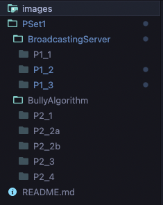

1. To run questions 1_1 to 1_3, replace "--Question--" with either "P1_1","P1_2","P1_3" in the following command:
```bash
go run -race PSet1/BroadcastingServer/--Question--/main.go 
```
2. To run questions 2_1 to 2_4, replace "--Question--" with either "P2_1","P2_2a", "P2_2b","P2_3", "P2_4" in the following command:
```bash
 go run -race PSet1/BullyAlgorithm/--Question--/main.go  
```

# Question 1
## Part 1
This would be the prompt when the program is ran:

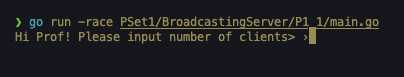

This would be the output after entering input:

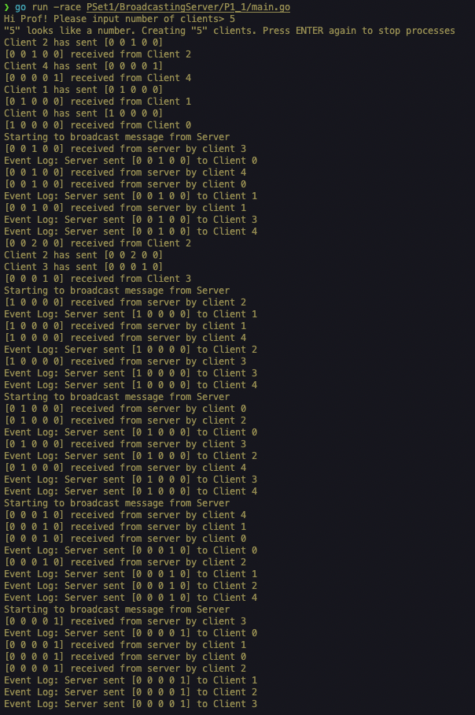


What we are looking for are:
1. the Clients are randomly sending messages (in the form of arrays)
2. Server received the messages immediately "[0 0 1 0 0] received from Client 2"
3. Server does not broadcast the messages in order (broadcasted  [1,0,0,0,0] from client 0 before [0,1,0,0,0] from client 1 even though server receives message from client 1 first)

Implementation details:
This is achieve with a asynchronous call of my "broadcast" function, where the function would sleep for a random delay before sending the message.

## Part 2
This would be the prompt when the program is ran:

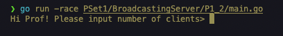

This would be the output after entering input:

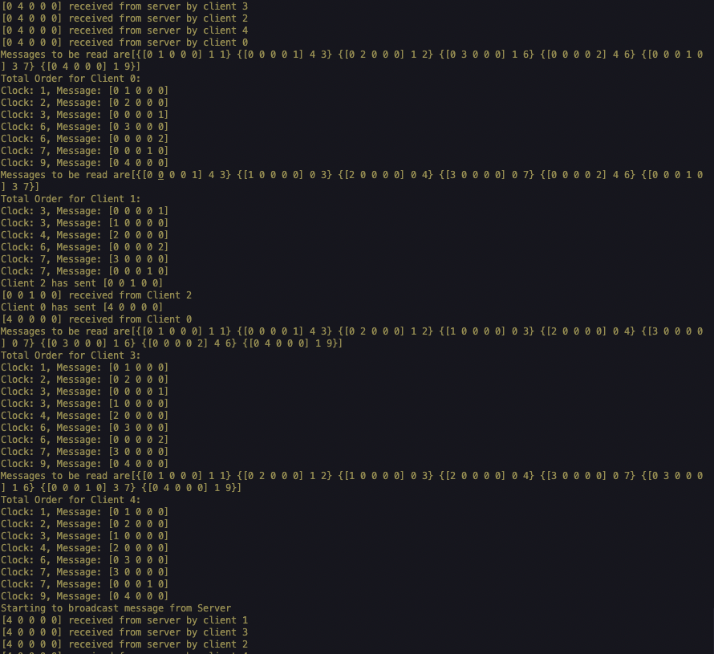

This would be the output after an ENTER keypress to end the program:

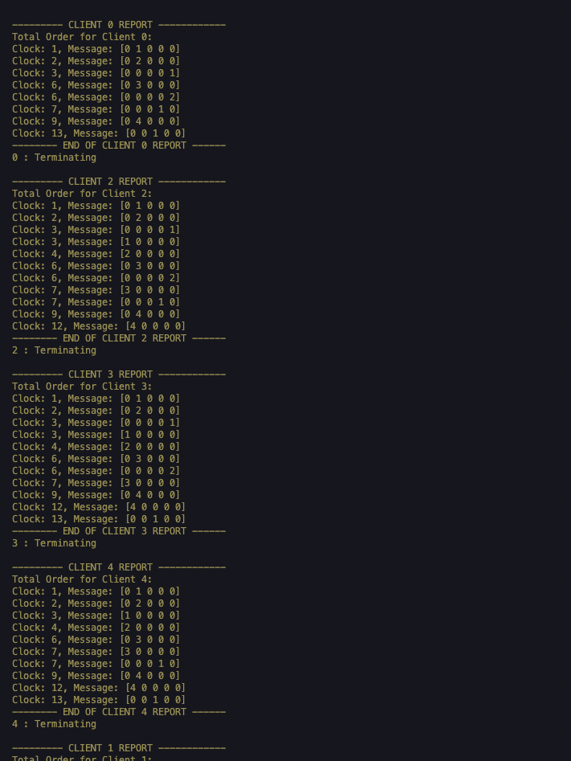


In addition to what we have seen in P1_1, What we are looking for are:
1. regular reports of the total order whereby the clients sort the messages to be read based on the logical clock attached to each message.
2. The final report generated an ENTER keypress is sent to end the program to summarize the order of messages 
3. The messages in the report are sorted based on the logical clock of the message.

Implementation details:
1. Each client would increment their logical clock before sending a message and after receiving the message
2. When a client receives a message, the client would compute the max of the message's clock and its logical clock before incrementing.


## Part 3
This would be the prompt when the program is ran:

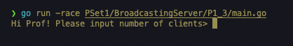

This would be the output after entering input:

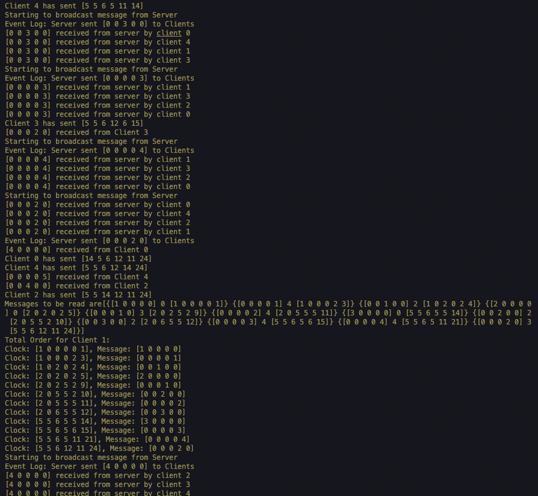

This would be the output after an ENTER keypress to end the program:

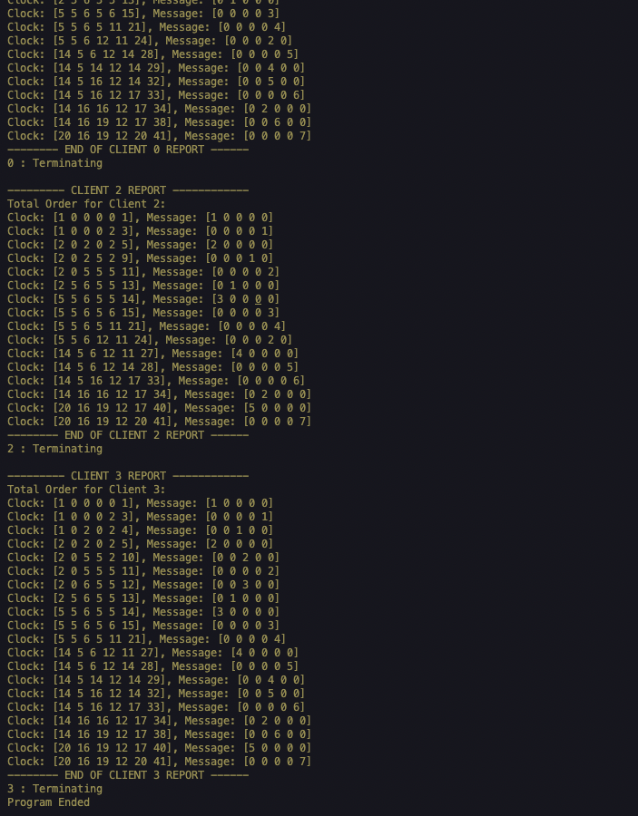


In addition to what we have seen in P1_2, What we are looking for are:
1. The messages contain a vector clock instead of a integer clock. 
2. The messages in the report are sorted based on the logical vector clock of the message.

Implementation details:
1. I had to create a function to compare two vectors where it was not need in P1_2 when comparing integers
2. I also had to create a function to perform the Max() of two vectors

# Question 2
## Part 1
There are two options available for part 1: (1) Best case and (2) Worst case

This would be the output when option (b) is selected for the best case scenario:

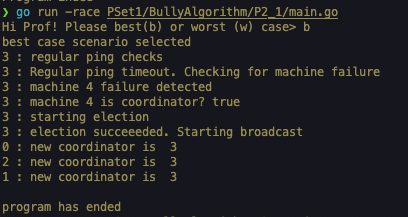

This would be the output when option (w) is selected for the worst case scenario:

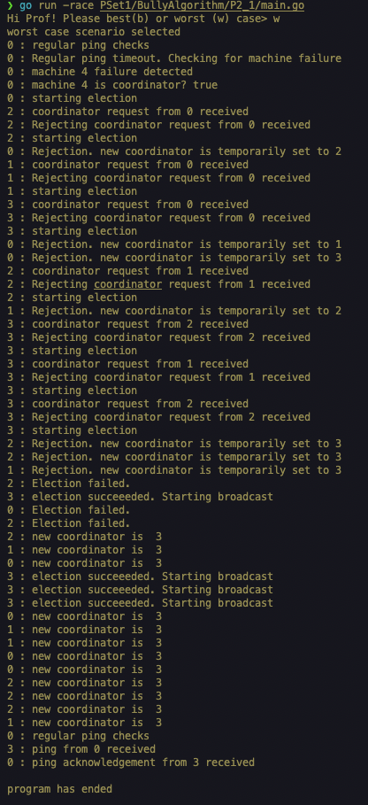

What we are looking for are:
[best case]
1. machine 4 (id=3) detects that machine 5 (id=4) is down and triggers an election
2. no rejection message is sent to machine 4, hence it results in a successful election. This enables machine 4 to broadcast to the rest of the machines that machine 4(id=3) is the new coordinator
[worst case]
4. machine 1 (id=0) detects that machine 5 (id=4) is down and triggers an election.
5. All other machines that are alive and with higher ids would reply with a rejection message and trigger an election on their own. This would continue until machine 4(id=3) encounters a successful election since no other machine can reject machine 4.

Implementation details:
1. Regular ping messages are sent to the coordinator. for this part, I have specified the machine to send the ping message to the coordinator to replicate the best and worst cases. 
2. Ping messages and election procedures each have a time out. A "select" statement handles each timeout to determine what to do next. If ping messages and election requests receive their respective responses before the timeout, no further action would be triggerd.
3. A message handler would help the machine determine what to reply and whether the machine itself needs to initiate an election.

## Part 2a (death of coordinator before completion of broadcast)
To create this scenario, I inserted a stopping point before the broadcast loop could end. I then self the machine state to "DOWN" which prevents the machine from replying. This can be seen from line 143-149:

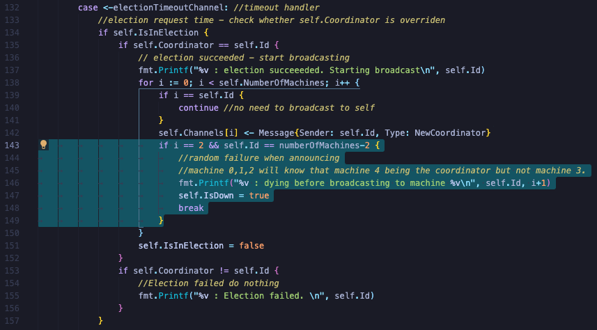

Thus the expected output is this:

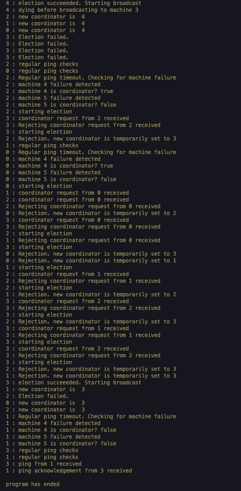

what we are looking for are:

1. after machine 4 has declared itself as the coordinator to machine 0,1,2, machine 4 enters a downstate.
2. This would cause machines 0,1 and 2 to trigger an election since their regular ping messages to the coordinator would fail when no replies are received.
3. The new election would result in machine 3 with the highest Id to be the coordinator 

## Part 2b (death of non-coordinator before completion of broadcast)'
To create this scenario I used a WaitGroup to wait for a node to die before continuing with broadcast. This can be seen from line 150-152:

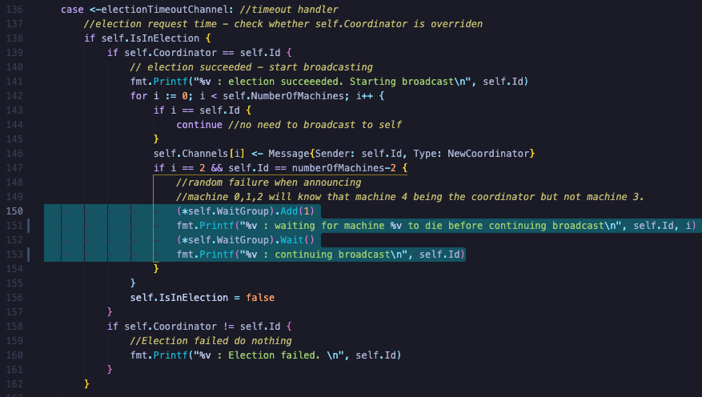

As well as on line 199-203:

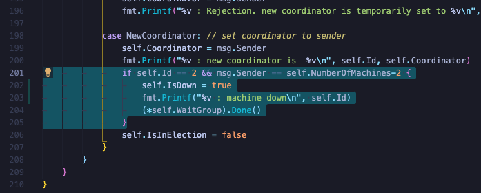

The expected result is therefore:

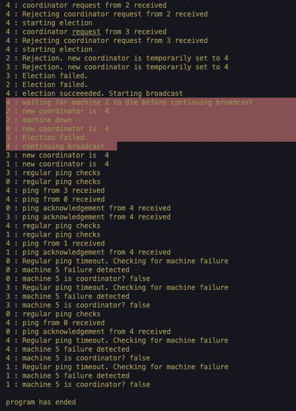

what we are looking for are:

1. machine 4 waits for machine 2 to die before finishing broadcast
2. This would cause any action to be triggered since machine 2 is not a coordinator and does not receive any ping requests

## Part 3
Part 3 is a variant of part 1, except there is no specified sender. Thus all machines are pinging the failed coordinator, and triggering elections concurrently.

The output would suggest that the protocol is robust against concurrently election requests:

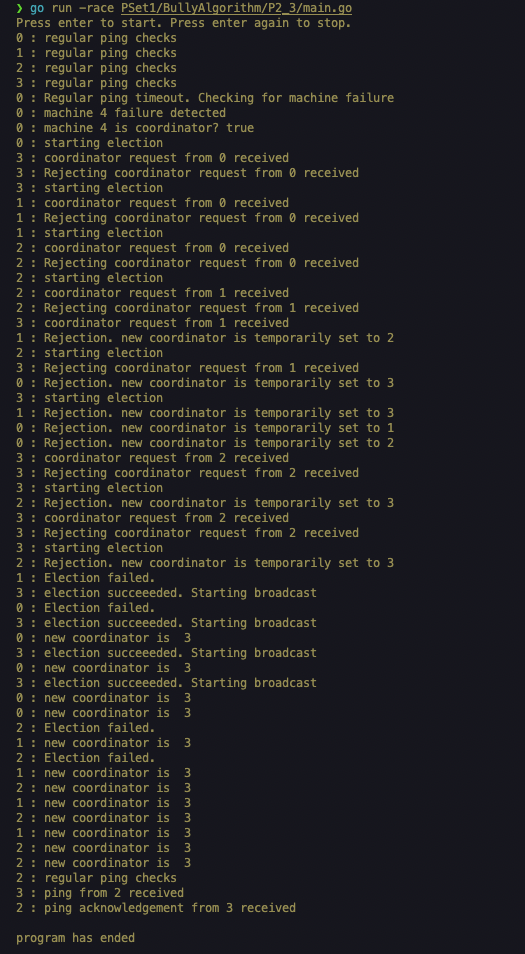

what we are looking for are:

1. multiple elections are started
2. New coordinator for all machines end up as machine 3 with the highest Id

## Part 4
I have made it such that any new machine joining would initiate an election. Thus this would inform all other machines that a new machine with a possibly higher Id has joined. 

The code changes can be found here in line 102-110 where an election is always started when a machine joins:

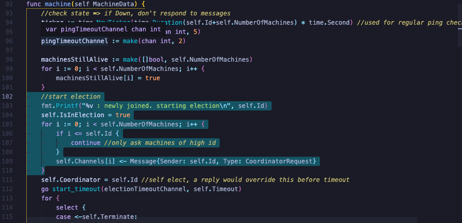

This would be an example output:

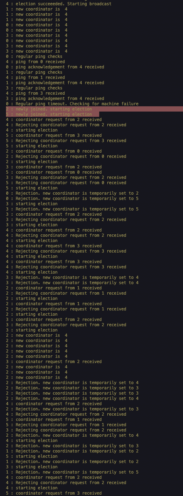

what we are looking for are:

1. Elections are started after machine 2 and 5 arrived
2. eventually machine 5 with the highest Id is elected as the coordinator.